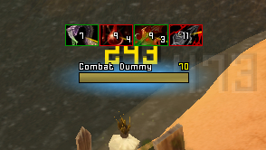
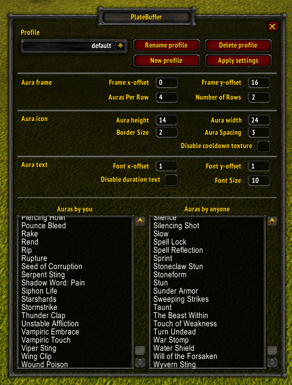

# PlateBuffer

## What does it do

PlateBuffer adds aura icons to enemy unit nameplates. You can choose which auras you want to see. It will only track auras that have a duration. The addon does not change your nameplates, only adds aura icons to them so it works with the default nameplates, Aloft, ElvUI and others.

## How to configure

Type `/pb` or `/platebuffer` in game to bring up the config menu.
To track new auras click inside one of the editboxes and press enter to make a new line and type in the name of the aura you want to track.
For dots and other auras that can have multiple instances I recommend only tracking your own.
**Click on 'Apply' after changing something!**

## How to install

Go to Releases in https://github.com/nullfoxh/PlateBuffer/releases and download PlateBuffer.zip. Extract it to your World of Warcraft/Interface/AddOns folder and you're done! The path should be: World of Warcraft/Interface/AddOns/PlateBuffer/PlateBuffer.toc.

## How does it work

To display auras on a nameplate we need to identify the nameplate first. This is done by targeting a unit, mouseovering a nameplate or by unit name (only for players). If a unit walks offscreen or you turn the camera so that the nameplate is hidden, it needs to be identified again before auras can be shown!

Spell durations and DRs are tracked by listening to the UNIT_AURA event as well as combat log events. A database of spell durations and debuff types is utilized for this.

## Technical limitations

The TBC client's API is quite limited compared to later versions with both the Combatlog and UnitBuff missing a lot of data. This means we can only track one instance of each aura and we need to rely on a database for durations outside of our own auras. We also can not account for talented durations.

## Known issues

* The cooldown texture will flicker when a nameplate moves. You have the option to disable the texture.

## Credits and acknowledgements

* Much love to Elyne for helping me with testing the addon and for gathering and filling aura data.
* Pyralis for letting me butcher his config GUI code.
* Cyprias for his LibAuraInfo, which I based my aura database on.
* Theroxis for helping me debug!
